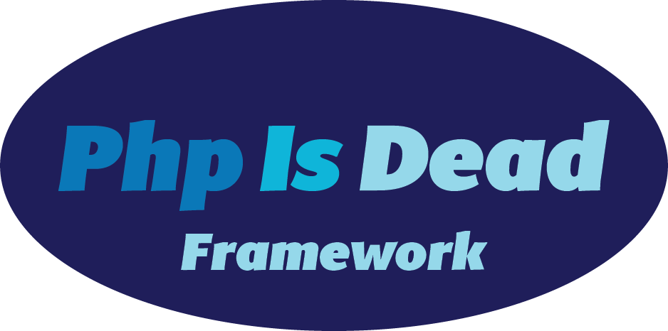

PhpIsDead is a php framework

# Dev

1. run "composer dump-autoload -o" instead of "composer dump-autoload" to see if any error to generate the autoloader

2. push to github

3. click "update" in https://packagist.org/packages/quantr/phpisdead

4. in your project, rm -fr package.lock vendor

5. composer install

6. you can see the changes

# Useful link

https://dev.to/joemoses33/create-a-composer-package-how-to-29kn

# The framework

## 